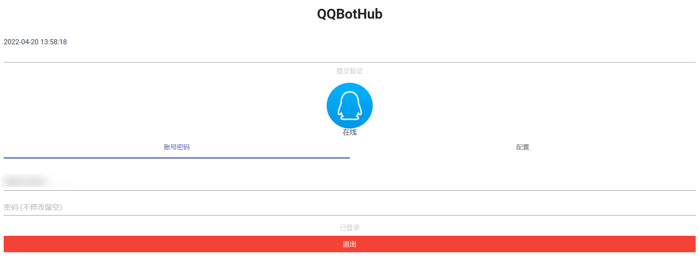

<h1 align="center">QQBotHub</h1>

> QQ 机器人 | 基于 [Konata.Core](https://github.com/KonataDev/Konata.Core) | 一键免费部署

[]()
[](https://github.com/yiyungent/QQBotHub/blob/master/LICENSE)
[](https://jq.qq.com/?_wv=1027&k=q5R82fYN)


## Introduce

QQ 机器人 | 基于 [Konata.Core](https://github.com/KonataDev/Konata.Core) | 一键免费部署

- **Web 可视化** 无需再在 Console 上操作
- **插件化架构** 轻松使用插件扩展

> **注意** : 本项目仅供学习使用, 所有第三方插件与本项目无关

## 功能

- [x] 在线 QQ 登录
- [x] 其它大部分功能由 插件提供
- [x] 本仓库 维护的 官方插件
  - [QQHelloWorldPlugin](https://github.com/yiyungent/QQBotHub/releases?q=QQHelloWorldPlugin&expanded=true)
    - [x] 复读好友私聊
    - [x] 上下线通知 设置 里的 AdminQQ
   - [MoLiPlugin](https://github.com/yiyungent/QQBotHub/releases?q=MoLiPlugin&expanded=true)
     - [x] 对接 [茉莉机器人 API](https://mly.app)
       - 自定义知识库, 各种功能
     - [x] 设置 机器人聊天群, 好友
   - [QQStatPlugin](https://github.com/yiyungent/QQBotHub/releases?q=QQStatPlugin&expanded=true)
     - [x] 收集群聊消息 
     - [x] `#日历`
     - [x] `#折线`

## Screenshots



### [QQStatPlugin](https://github.com/yiyungent/QQBotHub/releases?q=QQStatPlugin&expanded=true)


## Quick Start

### 部署

#### 方式1: 使用 Railway 免费 一键部署 

> - 点击下方按钮 一键部署      
> - Railway 每月有 `$5` 免费额度, 若只跑本项目完全够用

[](https://railway.app/new/template/A3JY-J?referralCode=8eKBDA)


##### Railway 环境变量

| 环境变量名称                | 必填 | 备注                    |
| --------------------------- | ---- | ----------------------- |
| `PLUGINCORE_ADMIN_USERNAME` | √    | PluginCore Admin 用户名 |
| `PLUGINCORE_ADMIN_PASSWORD` | √    | PluginCore Admin 密码   |


> 注意:    
> - Railway 修改环境变量 会 触发 重新 Deploy   
> - Railway 重新 Deploy 后会删除数据, 你安装的所有插件及数据都将清空。

#### 方式2: 使用 Heroku 免费 一键部署 

> - 点击下方按钮 一键部署    
> - Heroku 每月有免费时长   
> - Heroku 应用一段时间不访问会自动休眠, 因此为了保证存活, 请使用第三方监控保活, 例如: [UptimeRobot: Free Website Monitoring Service](https://uptimerobot.com/)   

[](https://heroku.com/deploy?template=https://github.com/yiyungent/QQBotHub)


##### Heroku 环境变量

| 环境变量名称                | 必填 | 备注                    |
| --------------------------- | ---- | ----------------------- |
| `PLUGINCORE_ADMIN_USERNAME` | √    | PluginCore Admin 用户名 |
| `PLUGINCORE_ADMIN_PASSWORD` | √    | PluginCore Admin 密码   |


#### 方式3: 使用 Docker

```bash
docker run -d -p 5004:80 -e ASPNETCORE_URLS="http://*:80" --name qqbothub yiyungent/qqbothub
```

```bash
docker exec -it qqbothub bash
```

> 现在访问: <http://localhost:5004/PluginCore/Admin>


### QQ 登录

> 部署完成后
> > 一定要先登录 `PluginCore Admin`, 因为 `QQ登录页面` 与 `PluginCore Admin` 使用相同权限      
> 1. 访问: <https://your-domain/PluginCore/Admin>  进入 `PluginCore Admin`
> 2. 访问: <https://your-domain> 进行 QQ机器人 登录

> 若为 `短信验证` , 则直接输入收到的验证码, 点击 `提交验证` 即可

> 若为 `滑动验证` , 则 `点击前往验证`, 浏览器在 `滑动验证` 页面 按 `F12`, 再选择 `Network`, 通过滑动验证后, 复制 `ticket` 如下 (不要包括双引号), 将 `ticket` 粘贴到输入框, 点击 `提交验证` 即可


> 注意验证不要等待太久, 否则尝试刷新登录页面 以重新登录及获取新验证


> **注意**    
> 当 无法登录 时
> - 当 `滑动验证` `验证通过` 后, 等待一会 , 还是 `无法进入已登录状态`       
> - 可 下载 [Releases - ConsoleApp - Assets](https://github.com/yiyungent/QQBotHub/releases?q=ConsoleApp&expanded=true) 在本地登录成功后, 获取 `BotKeyStore.json` 后, 在登录页面使用 `配置` 方式登录
>   - 运行 `ConsoleApp.exe` 无需额外安装 `.NET SDK 或 Runtime`, 程序已打包


### 插件管理

访问: <https://your-domain/PluginCore/Admin>  进入 `PluginCore Admin`

> 插件:   
> 下载插件包, 
> > 插件包下载见 [Release](https://github.com/yiyungent/QQBotHub/releases) , 
> > 直接插件上传 下载的 `QQHelloWorldPlugin-net6.0.zip` 即可    
> 
> 然后直接 `上传 -> 安装 -> 文档 -> 设置 -> 启用 -> 文档` 即可


## 插件开发

> 注意:  
> 所有纯基于 `PluginCore.IPlugins` 开发的插件都通用,   
> 下载插件包, 然后 `上传 -> 安装 -> 设置 -> 启用` 即可


> 插件开发 可参考:   
> - [插件开发 | PluginCore](https://moeci.com/PluginCore/zh/PluginDev/Guide/)      
> - **建议** 参考: [./plugins/QQHelloWorldPlugin](https://github.com/yiyungent/QQBotHub/tree/main/plugins/QQHelloWorldPlugin)

> QQBotHub 插件开发包  
> 插件开发包中已包含:   
> - `Konata.Core`
> - `PluginCore.IPlugins`

```powershell
dotnet add package QQBotHub.Sdk
```

> **注意**:   
> - 本项目目前直接使用的 `PluginCore` 插件框架, 插件采用激活方式, 插件工作完成后, 实例会立即销毁, 无法常驻后台
> - 若需要定时任务, 可以使用 `ITimePlugin`, 可见 `PluginCore` 的文档    
> - 由于 QQBot 本身为常驻, 因此需额外注意 `IPluginFinder` 的服务的生命周期/范围, 这点和在 `ASP.NET Core` 的 `Controller` 中 直接使用不同

## 相关项目


- [KonataDev/Konata.Core](https://github.com/KonataDev/Konata.Core)
- [yiyungent/PluginCore](https://github.com/yiyungent/PluginCore)


## Donate

QQBotHub is an GPL-3.0 licensed open source project and completely free to use. However, the amount of effort needed to maintain and develop new features for the project is not sustainable without proper financial backing.

We accept donations through these channels:

- <a href="https://afdian.net/@yiyun" target="_blank">爱发电</a> (￥5.00 起)
- <a href="https://dun.mianbaoduo.com/@yiyun" target="_blank">面包多</a> (￥1.00 起)

## Author

**QQBotHub** © [yiyun](https://github.com/yiyungent), Released under the [GPL-3.0](./LICENSE) License.<br>
Authored and maintained by yiyun with help from contributors ([list](https://github.com/yiyungent/QQBotHub/contributors)).

> GitHub [@yiyungent](https://github.com/yiyungent) Gitee [@yiyungent](https://gitee.com/yiyungent)

